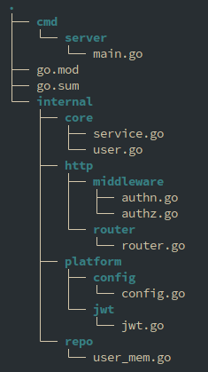
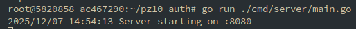
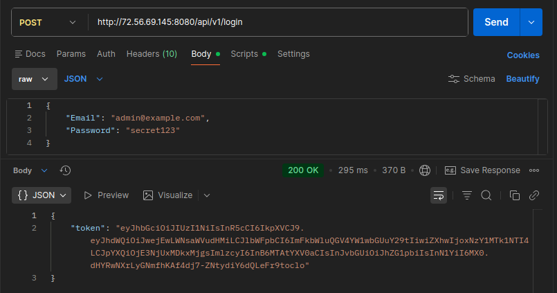
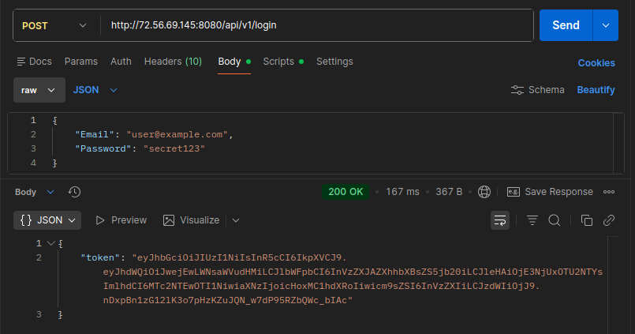
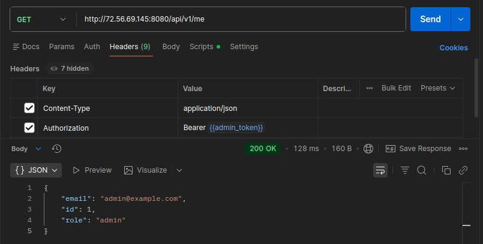
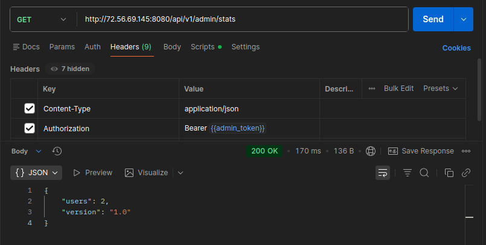
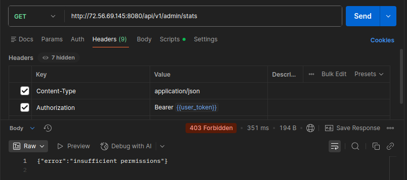
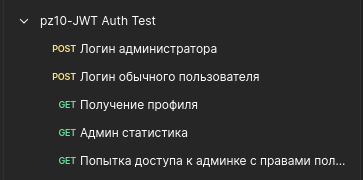

# Практическое задание № 10

# JWT-аутентификация: создание и проверка токенов. Middleware для авторизации

Студент группы *ЭФМО-02-25 Пягай Даниил Игоревич*

# Описание

**Цели:**

    • Понять устройство JWT и где его уместно применять в REST API. 
    • Сгенерировать и проверить JWT в Go (HS256), передавать его в Authorization: Bearer …. 
    • Реализовать middleware-аутентификацию (достаёт токен, валидирует, кладёт клеймы в context). 
    • Добавить middleware-авторизацию (RBAC/права на эндпоинты). 
    • Встроить это в уже знакомую архитектуру HTTP-сервиса/роутера.


## Инициализация проекта

```bash
mkdir -p ~/pz10-auth
cd ~/pz10-auth
go mod init pz10-auth
go get github.com/go-chi/chi/v5
go get github.com/golang-jwt/jwt/v5
go get golang.org/x/crypto/bcrypt
```

## Создаём структуру файлов



# Запускаем сервер


# Логин администратора - получить токен


# Логин пользователя - получить токен


# Запрос профиля - используем токен


# Запрос статистики (админ)


# Запрос статистики (пользователь)


## Список проведённых запросов

